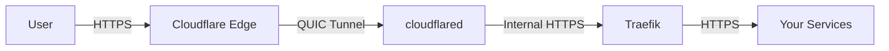
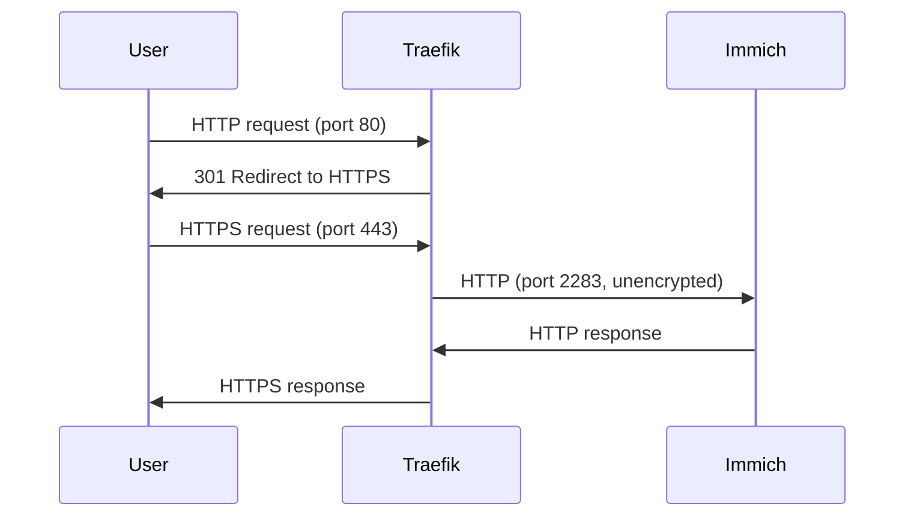

# 🌐 Cloudflare + Traefik: Zero-Exposure Proxy
Secure reverse proxy with no open ports using Cloudflare Tunnels and Traefik. Perfect for self-hosting with enterprise-grade security.

## 🔥 Key Features

- 🚫 No open ports – All traffic flows through Cloudflare’s encrypted tunnels (no inbound firewall rules).
- 🔒 Zero Trust ready – Origin server IP stays hidden; no direct internet exposure.
- 🤖 Fully automated – Wildcard TLS certificates via Cloudflare DNS challenges.
- 🚀 Production-optimized – TLS 1.3, security headers, and health checks.
- 🛠️ How It Works



## 🚀 Quick Start

### Prerequisites

Cloudflare account with a domain (example.com)
Docker installed

### Setup
1. Clone the repo:
```bash
git clone https://github.com/your-repo/cloudflare-traefik.git  
cd cloudflare-traefik  
```

2. Configure environment:
```bash
cp .env.example .env  
# Edit .env with your Cloudflare API token, email, and domain  
```

3. Deploy
```bash
./setup
```

### Example configure when add new service
```yml
    labels:
      - "traefik.enable=true"
      # HTTP → HTTPS redirect
      - "traefik.http.routers.immich.entrypoints=web"
      - "traefik.http.routers.immich.rule=Host(`immich.example.com`)"
      - "traefik.http.middlewares.immich-https-redirect.redirectscheme.scheme=https"
      - "traefik.http.routers.immich.middlewares=immich-https-redirect"
      
      # HTTPS router
      - "traefik.http.routers.immich-secure.entrypoints=websecure"
      - "traefik.http.routers.immich-secure.rule=Host(`immich.example.com`)"
      - "traefik.http.routers.immich-secure.tls=true"
      - "traefik.http.routers.immich-secure.service=immich"
      
      # Backend config 
      - "traefik.http.services.immich.loadbalancer.server.scheme=http"
      - "traefik.http.services.immich.loadbalancer.server.port=2283"
      - "traefik.docker.network=proxy"
```


